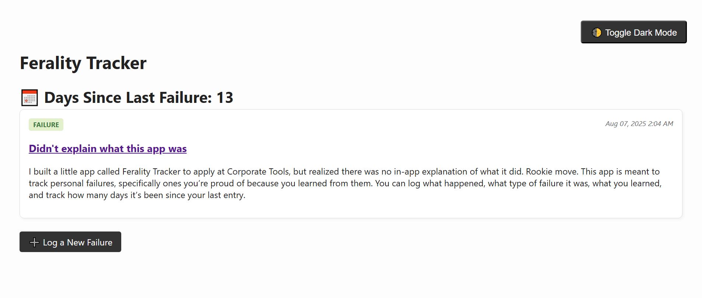

# Ferality Tracker

Ferality Tracker is a lightweight failure tracker that lets you log your personal failures and what you learned from them. Inspired by the company Corporate Tools and their belief that all failures are opportunities to learn and grow.

Live deployment here: https://ferality-tracker.onrender.com/



---

## Setup & Installation

To run locally:

```bash
git clone https://github.com/ok-kee/ferality-tracker.git
cd ferality-tracker
bundle install
bin/setup
bin/rails server
```

Then open your browser to: [http://localhost:3000](http://localhost:3000/)

**Prerequisites (This app assumes a working local Rails development environment.):**

- Ruby 3.4.5
    
- Rails 8.0.2
    
- SQLite  

---

## Usage

This app is built to help you log your failures, the things you tried that didn’t work, and reflect on what you learned. The goal is to make that process visible, repeatable, and motivating.

To use it:

- Click “Log a New Failure”
    
- Log something you tried that didn’t work
    
- Choose a category: Error, Mistake, or Failure (see the in app definitions of each category)
    
- Describe what happened and what you learned
    
- Submit and track your streak
    

In the spirit of Corporate Tools’ “sprint toward failure” mentality, the app tracks how many days in a row you’ve logged something. As they say on their Why Work Here page: "If you’re into learning, you understand the quickest and easiest way to do so is to fail a lot of times."

---

## Tech Stack

- **Framework:** Ruby on Rails 8.0.2
    
- **Language:** Ruby 3.4.5
    
- **Database:** SQLite (local development)
    
- **Styling:** Hand-rolled CSS (no design system)
    
- **Interactivity:** Turbo (Hotwire)
    
- **Deployment:** Render
    

---

## Features

- Card-based post system for logging personal failures
    
- Categorization by type: Error, Mistake, Failure
    
- Learning field to reflect on each experience
    
- Daily streak counter based on `created_at`
    
- Light/dark mode toggle with persistent setting
    
- Standard Create, Read, Update, Delete (CRUD) flow
    

---

## Motivation

I built this as part of an application to Corporate Tools after reading about their “feral” culture and philosophy of learning through failure. Their anti-corporate spirit, respect for builders, and focus on crafting tech that works really resonated with me. This app reflects that: it’s small, opinionated, and built fast with care.

---

## Known Limitations

- No user accounts — this is a deliberately shared open demo
    
- No data persistence guarantees (data may be wiped/reset)
    
- No profanity filter — please be respectful when testing
    

---

## Future Ideas

- Add user accounts and authentication
    
- Filter failures by category, tag, or date
    
- Responsive mobile view
    
- (Stretch) Explore integrating an LLM to suggest resources or insights based on failure type
    

---

## Project Status

This project is complete and intentionally scoped. It’s not under active development but serves as a finished artifact to demonstrate thoughtful execution, aligned values, and product intuition.

---

## License

All rights reserved. This project was created specifically for a job application and is not licensed for reuse or distribution.

---

